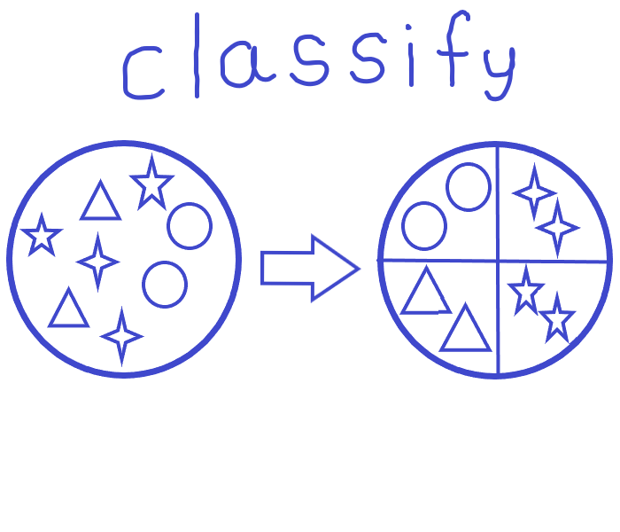

# JPay - Customers Classify


<p align="center">
  
</p>

This project contains a SPA that consumes a Golang API integrated with a SQLite database.
The main purpose is to consume a table with customers details (name and phone number) and categorize it.

The categorization firstly identify the country, country code and splitting it from phone number;
Validate the phone number to identify if it's a valid data;

The SPA displays the result with a default result limit (10) and pagination;
In SPA, you're able to filter the customers by their country and state of phone data (if it's a valid data or not);

## Technologies
- Golang 1.17
- Gin Gonic v1.7.7
- GORM v1.22.4

## First steps

### Go Runtime Version
Have go [installed](https://golang.org/doc/install) in your computer

### Installing dependencies
Run the following command into /src to get the dependencies installed
```
go install
```

### Starting the application

Run the following command into /src to get the application started
```
go run main.go
```

## Testing
After you have started the application, you can access the customers page here:
[CUSTOMERS PAGE](http://localhost:8080/)

And also, can consume Customer API directly using the postman collection located in root of this directory:
[POSTMAN_COLLECTION](https://github.com/kaiqnes/jpay/blob/main/nunes_jpay.postman_collection.json)
